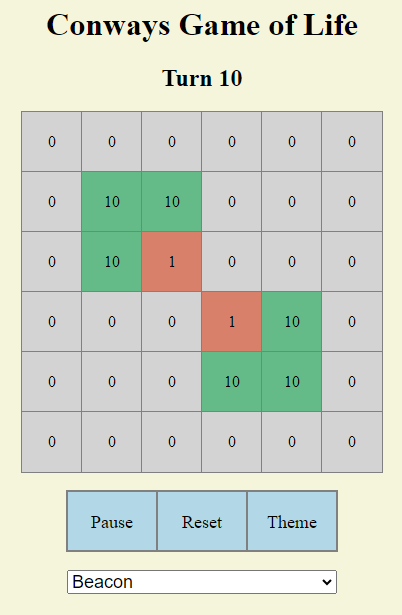
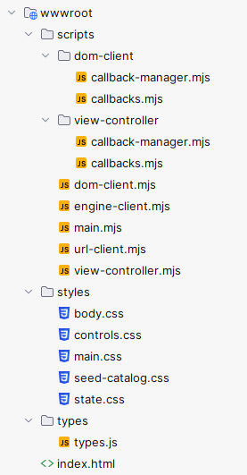
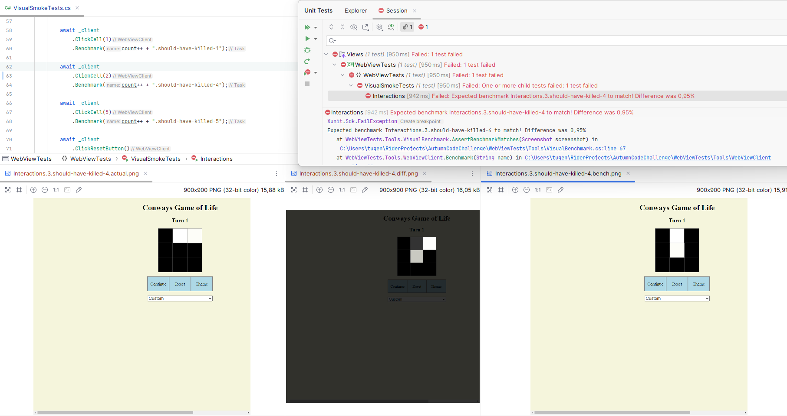

# Autumn Code Challenge 2023

A fun code challenge I manged to to complete between July 2023 and February 2024. 
The focus was to implement a skeleton that can be forked for future fun code challenges.
Processwise I went with 'As Simple as Possible, but No Simpler (rule 1)'.

Stylewise I leaned heavily into functional programming, i.e. immutability and statelessness,
expressions over statements.

As the catalyst, I chose the very simple cell simulation 'game' of Conway's Game of Life.

You can find the full the prompt [here](https://tugend.github.io/challenges/2023/07/28/autumn-code-challenge.html).



## Components

### Core Domain written in C#
  - Encapsulates how to transition from one state to the next by applying the rules of the Game.
  - A catalog of named game states with interesting properties.
  - Includes simple but comprehensive suite of unit tests.
  
### Terminal View in C#
  - A simpler stepping stone when developing the domain since it's text based.
  - Uses the core domain assembly directly 
  - Has a hardcoded seed
  - Includes a single smoke test test that starts the program as a separate process and interacts via standard input/output. 

  ```cmd
    > dotnet run --project .\CliView\CliView.csproj
    
    Starting ...
    
    Turns: 1
    Grid
    0 1 0
    1 0 0
    0 0 0
    
    Turns: 2
    Grid
    0 0 0
    0 0 0
    0 0 0
    
    Enter key to quit.
    Thanks for playing. Goodbye.
  ```

  ```csharp
    [Fact]
    public async Task SmokeTest()
    {
        // Arrange
        using var process = ApplicationTestRunner.StartApplication(typeof(Program));
        
        // Act
        var (read, waitFor) = ApplicationTestRunner.InitOutputBuffer(process);
        
        // Assert
        await waitFor("Enter key to quit", FromSeconds(10));
        
        read()
            .Should()
            .Be("""
                Starting ...
    
                Turns: 1
                Grid
                0 1 0
                1 0 0
                0 0 0
    
                Turns: 2
                Grid
                0 0 0
                0 0 0
                0 0 0
    
                Enter key to quit.
                """);
        
        process
            .HasExited
            .Should().BeFalse("Should hang until ENTER");
    
        await process
            .Enter()
            .Then(x => x.WaitForExitAsync())
            .Then(x => x.HasExited.Should().BeTrue("Should exist on ENTER"));
            
        read()
            .Should().Be("Thanks for playing. Goodbye.");
    }
  ```

### WebView in C# + Javascript

#### Backend
Backend Minimal API in C# that expose the core domain as a game engine.
I.e. an endpoint to get the catalog of named starting states.
and and endpoint that takes a state and returns the next 10 turns from given state.
- ```
  GET /api/conway/catalog -> GameState[]
  ```
- ```
  POST /api/conway/states -> State[] 
  { State }
  ```

#### Frontend      
Frontend written as Javascript modules and weakly typed using JSDoc, css with nesting and a classic index.html file.
I was pretty happy with the separation of concerns and and control of dependencies.

Includes behavior and visual Selenium-based end-to-end tests written in C#,
backend is started as a separate running process,
and failed visual tests will save a diff and actual screenshot for comparison.
I was pleasantly surprised how simple it was possible to bootstrap visual tests compared to prior experiences.,



Game features includes
  - Pause/unpause
  - Kill or seed a single cell
  - Display turn count
  - Display cell with generation 
  - Restart with another seed state from catalog of named seeds
  - Switch between colored cells with generation number and black(dead) and white(live).


        
### Github Pipeline

- Runs build, dotnet unit tests, dotnet visual and behavioral end to end tests and eslint as a merge check.
- As a last bit of gold plating, I added a cache on the Dotnet nuget packages reducing package restore from 1-2 minutes to ~20 seconds.

### Working Notes

#### Kill dangling port hugging process

If tests are force quite via the IDE, they don't get to do their graceful shutdown,
and may leave a process dangling.

```cmd
# Identify a process by what port it has locked
> netstat -ano | findstr :<PORT>

# Kill the task
> taskkill /F /PID <PID>

# Shorthand node program that do same as above
> npx kill-port 8080
```

Windows Resource manager   
-> CPU  
-> search for the locked file   
-> to lookup the name of the process has it locked e.g. WebView

Windows task manager   
-> WebView   
-> close